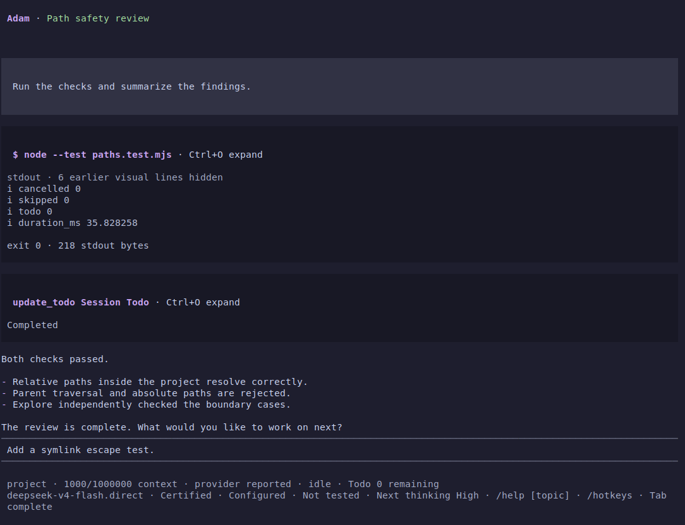
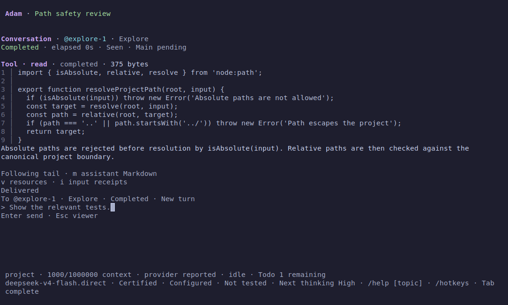
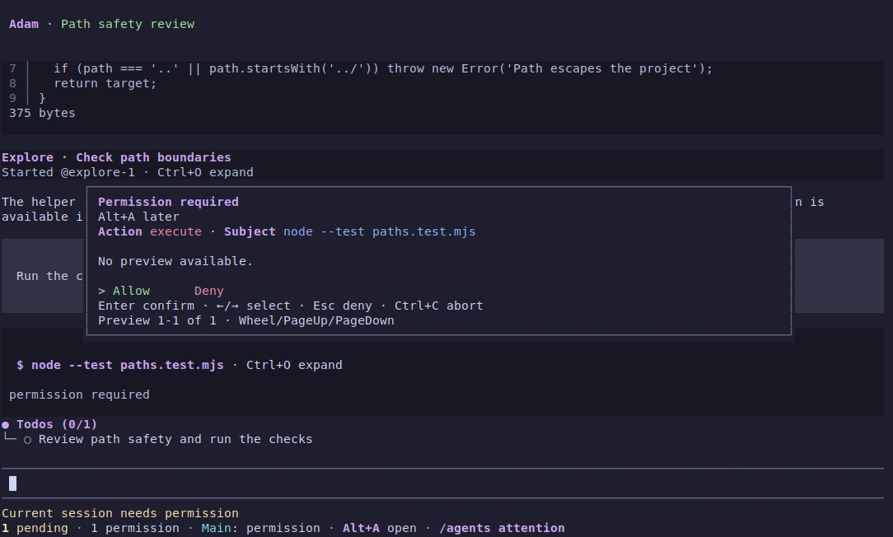

# Adam Agent

A local coding agent for Linux. Inspect a repository, make reviewed changes, run commands with approval, and work with Explore and Research agents from one terminal.



Screenshots show the installed application with a deterministic provider fixture. File tools, commands, permissions and terminal interactions run for real.

## What you can do

- **Read, search and change code.** Find files and matches, inspect bounded text ranges, review prepared edits, and approve shell commands with visible results.
- **Keep work visible.** Track Todos, inspect tool output and reasoning, use Plan for exploration and approval, and return to earlier conversation boundaries.
- **Work across agents.** Delegate to Explore or Research, read full Child conversations, keep independent drafts, and handle permissions or replies through one pending-items entry.
- **Keep your history.** Resume or branch sessions, archive idle work, and move a Main session with its owned Child histories to recoverable Trash.

## Quick start

Use Linux, Node.js 24, and the exact pnpm version declared by the repository. Clone, install and build once:

```sh
git clone https://github.com/DrEden33773/adam-agent.git
cd adam-agent
corepack enable
pnpm install --frozen-lockfile
pnpm build
```

Set your DeepSeek credential in your shell, then start an exact model target:

```sh
export DEEPSEEK_API_KEY="your-api-key"
node apps/tui/dist/main.js --target deepseek-v4-flash.direct
```

Trust the project when prompted and enter a task. `deepseek-v4-pro.direct` is also available. Keep credentials in your environment or an ignored project `.env`; never put them in a prompt. The [setup guide](docs/setup-and-development.md) covers configuration, target selection and optional integrations.

Running `node apps/tui/dist/main.js` without a target opens session or model selection. Missing credentials lead to configuration guidance. `/connection` performs an explicit connectivity check. For source development, `pnpm tui` rebuilds before launch; the direct Node entry uses existing output.

## Install locally

Build a movable archive from the checkout and install it under a local prefix:

```sh
pnpm package:local /tmp/adam-package
mkdir -p /tmp/adam-unpacked
tar -xzf /tmp/adam-package/adam-*.tar.gz -C /tmp/adam-unpacked
node /tmp/adam-unpacked/adam-*/install.mjs install "$HOME/.local"
export PATH="$HOME/.local/bin:$PATH"
```

Then open a terminal in your project and run `adam`. The launcher preserves that directory and uses its project configuration. `adam-cli` provides the headless CLI. Installed commands need Node.js 24 and a compatible Linux architecture/libc; they do not compile or invoke pnpm. Use a new output directory for each package build.

The [installation guide](docs/local-installation.md) covers moving the archive, switching versions and uninstalling application files while retaining sessions, credentials and configuration.

## Everyday use

| Action | Entry |
| --- | --- |
| Find commands and arguments | `/help`, `/hotkeys`, and Tab completion |
| Select project paths or agent references | `@` completion; select a candidate to keep its exact identity |
| Select Skills for the next turn | `/skills` |
| Browse or toggle Todos | `/todos` · Alt+T |
| Enter Plan | `/plan` |
| Open a Child conversation | `/agents` → Enter; press Enter again to compose |
| Handle pending permissions and replies | Alt+A · `/agents attention` |
| Open session history | `/resume` |
| Name or branch the current session | `/name <text>` · `/fork` |
| Exit and settle local work | Ctrl+Q · `/exit` |

### Child conversations and permissions

Child pages open in browsing mode. A fresh Enter opens that Child's editor; Escape keeps its draft and returns to browsing, then to the originating view. Main keeps its own input and reading position. Pending items remain discoverable while you work elsewhere.





### Session history and Todos

In `/resume`, Tab switches Active, Archived and Trash. Ctrl+A archives or unarchives the selected idle session; Ctrl+U undoes the visibility change. Ctrl+D previews Trash and starts with Cancel selected. In Trash, Enter restores the whole session unit. Ordinary derived branches block deletion, and unfinished work must be resolved before Archive or Trash.

New sessions allow built-in Todo bookkeeping without repeated approval. Existing sessions retain their recorded policy; `/session settings` offers an explicit Todo permission upgrade. Completed Todos leave the fixed status area when their Main run ends and remain available in history.

## Support and permissions

Linux with Node.js 24 is the supported application environment. Built-in file tools confine paths to the project; writes, shell execution and delegation keep their own approval requirements. Review the exact operation before allowing it. Approved shell commands and MCP servers run with your account's authority, and extensions are trusted in-process code. Adam does not provide an OS, process, or network sandbox.

Explore and Research children stay within their inherited role and permission limits. They can inspect and coordinate; they cannot write files, execute shell commands, use MCP or create nested agents. See [managed agents](docs/managed-control-candidate.md) for configuration, capacity and recovery.

## Documentation

- [Daily workflows and session recovery](docs/usage.md)
- [Local installation](docs/local-installation.md)
- [Setup, models and development commands](docs/setup-and-development.md)
- [Coding tools](docs/coding-tools.md) and [managed agents](docs/managed-control-candidate.md)
- [Runtime and compatibility reference](docs/runtime-reference.md)
- [Testing](docs/testing.md), [acceptance evidence](docs/portfolio-acceptance.md), and [screenshot provenance](docs/screenshots.md)
- [Extension API](https://github.com/DrEden33773/adam-agent/blob/main/packages/extension-api/README.md) · [engineering instructions](AGENTS.md)

The public Extension API has its own versioned package lifecycle. Installing it alone does not install the Adam application.
